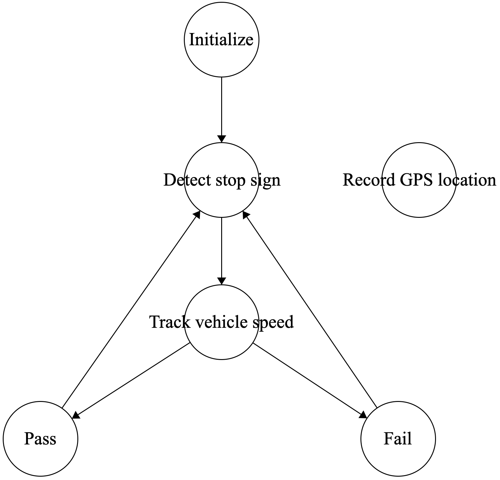

# Table of Contents
* Abstract
* [Introduction](#1-introduction)
* [Related Work](#2-related-work)
* [Technical Approach](#3-technical-approach)
* [Evaluation and Results](#4-evaluation-and-results)
* [Discussion and Conclusions](#5-discussion-and-conclusions)
* [References](#6-references)

# Abstract

For our project, we strive to design an efficient technique to check the driver’s behavior (e.g. stop the car before the STOP sign) and remind them to follow the traffic law with a punishment and reward mechanism. In order to measure our success, we evaluate our final system in how well the various aspects of the stop sign detection and warning system can be implemented. This includes stop sign detection/locating, movement detection (car’s speed), formulation of the application system, punishment and rewarding notification, and etc. We capture real-time images through in-built method in python and then use existing methods in opencv as the foundation of our algorithm to detect STOP signs in real-time. We implement car motion/speed detection through OBD-II and car location tracking through GPS. We also integrate this work with a camera system, and have a main source where each component is controlled accordingly. Furthermore, we create our application system through a Finite State Machine and incorporate with a punishment and rewarding mechanism to make the user experience more exciting. Results are promising as the system performs correctly as there are STOP signs in the test road. However, it has possible improvements such as better STOP sign detection algorithms that could detect partially visible signs and give users more accurate and safe instructions. We believe this project could be a foundation for an more accurate and feasible application of STOP sign detection, and help users/drivers follow the traffic rules in a more scientific way. 

# 1. Introduction

In our home country, there is no such thing as a stop sign. When we first drove in the US, it took us some time to get used to the stop sign rules. However, we notice that some people do not come to a complete stop or even run through stop signs when they don't see a police officer nearby. This bad driving habit might put other drivers or pedestrians in danger. Approximately one third of all vehicular accidents occur in stop sign controlled intersections. Furthermore, these accidents account for over 40% of all fatal vehicular accidents [1]. Thus, it is important to improve the driver’s awareness of stop signs and enforce the stop sign rule. Our goal is to implement an application that can improve stop sign awareness for driving safety. This app will include features such as detecting stop signs, recording GPS locations, tracking vehicle speed, determining if the driver follows the rule, rewarding or punishing the driver accordingly.

Vehicle accident happens every day, every hour, even every minute. According to the United States Department of Transportation (USDOT), approximately one third of all vehicular accidents occur in stop sign controlled intersections. While we currently only have applications like StopWatcher that with a fixed stop sign location database, this is not safe and accurate enough for users to use in real world cases. In the meanwhile, current applications in this area are not motivating, it only gives rigid instructions to users. And if someone does not stop at the stop sign, there is no effective way to catch and punish them, since police officers would not be every stop sign. With insufficient supervision, there are lots of irresponsible drivers who do not fully stop or not even stop at the stop sign. This causes lots of hurts and death. So, we strive to develop an interesting application which could detect stop sign with a more accurate and real-time technique, and motivate users to follow the traffic rule in an interesting way.

Currently, we have some old-fashioned stop sign warning systems, e.g. StopWatcher[1], which could remind drivers of the stop sign through real-time location tracking (GPS) and stop sign databases. But this kind of application has been out for a decade, while the development of computer vision is fast, we are able to build a stop sign recognition model to detect stop signs in a real-time mechanism. Thus, apart from recording the stop sign location into a database, our application is able to remind drivers to make appropriate reaction to the stop signs that are not in our database. In this way, our application could provide user safer experience. We also strive to add more interesting features to our application, for example, we are trying to make a ranking system like WeRun. By deducting and adding points to the user’s account, users in our platform will get a ranking on a daily basis. This new feature will motivate users to follow the traffic rule and further decrease vehicle accidents.

If our project is successful, we have an efficient way to monitor the driver’s behavior at the stop sign. We hope we can have a daily ranking of users’ performances in reacting to stop signs, better driving behavior can bring the driver to a higher rank. In the same time, with the warning of upcoming stop signs in real time, vehicle accidents in stop sign controlled intersections would be reduced, users’ safety would be further guaranteed. 

There are still some challenges existing in our project, like cameras should be set at an ideal degree to monitor the stop signs on the road. And due to the imperfection of the stop sign recognition model, there is a low possibility of detecting other things as stop signs and failing to detect stop signs. Also, stop signs in the shadows or being partially covered by other objects is a big challenge for the recognition model to detect, while the location of stop signs might still have not been added to our database. And there might be some privacy issues due to the fact that we capture the images from our camera on traffic and record locations from GPS in a random manner.

To perform the project well, there are several aspects need to be handled carefully. First, for the system to be reliable and robust, a stop sign detection model with high accuracy and precision is required. Second, we need to know how to read real-time vehicle speed from the OBD-II interface and also the GPS locations from the tracker. Third, the skill to design an algorithm that can correctly detect if the driver follows the rule is also required. Finally, a closed road or safe open road test is also required in order to perform the test and debug.

We decide to measure the success of our application through four perspectives. 1. the accuracy of detecting stop signs on a real-time basis. 2. the accuracy of the longitude and latitude of stop signs stored in our database. 3. drivers receive the stop sign reminder ahead with enough time for making a stop action. 4. the pass/fail rule standards are acceptable for users.  

# 2. Related Work

Traffic sign recognition is a technology by which a vehicle is able to recognize different traffic signs and this is part of features collectively called ADAS (Advanced Driver Assistance Systems). It uses image processing techniques to detect traffic signs and the detection method can be generally divided into color based, shape based and learning base methods.

Modern traffic sign recognition systems are being developed using convolutional neural networks (CNN), mainly driven by the requirements of autonomous vehicles and self-driving cars. And a CNN model can be trained to take in predefined traffic signs (e.g. stop signs) while learning with Deep Learning techniques. 

There are various algorithms for traffic sign detection. Most are based on the shape of the sign board, such as hexagons, circles, and rectangles, that define different type of signs, which can therefore be used for classification. Some are based on the character recognition includes AdaBoost detection, Freeman Chain code, Haar-like features, and deep learning neural networks method. Our stop sign detection algorithm has used Haar-like features to create cascaded classifiers, which could help the program to detect the sign board characters and therefore recognize the stop sign.

GPS is the technology  used to record the location information about the stop sign and this is crucial for our warning function of upcoming stop signs. GPS is very mature these days for recording the location accurately at a very affordable expense.

On-board diagnostics (OBD) is a term referring to a vehicle's self-diagnostic and reporting capability. OBD systems give the vehicle owner or repair technician access to the status of the various vehicle subsystems. Commonly supported OBD II data are vehicle speed, engine RPM, throttle position, fuel level, etc.

# 3. Technical Approach

### 3.a. Application Logic (Finite State Machine): 
The application presents itself as a finite state machine. It has a total of 6 states it uses: INIT, DETECT_STOP_SIGN, TRACK_VEHICLE_SPEED, PASS, FAIL, RECORD_GPS. 

The application first starts in the state INIT where it begins reading in feed from the camera source. And since there are about 3 seconds time lag for application to start (initialize/launch the GPS and OBD II), the state INIT can be seen as a preparation stage for our camera source gets real-time frames of traffic road. After every features of this applications work as expected, it then moves onto the state DETECT_STOP_SIGN. 

During DETECT_STOP_SIGN, traffic road will be framed into images with a 0.1s interval. There will be a stop sign recognition model to detect the existence of “stop sign” in the framed images. Once a “stop sign” has been detected, it expects the following 0.4s (4 framed images) also contain “stop sign”. If the “stop sign” detect counts reach to 5, the application will confirm the “stop sign” exists in current traffic road, the current GPS data will be added into the stop sign location database, and the application moves to the TRACK_VEHICLE_SPEED state. If the “stop sign” detected manner terminates, the detect counts will be reset to 0, and still in the current state. 

During TRACK_VEHICLE_SPEED, the application will continuously record car speed. If car speed has reached 0 in a predefined time range from confirming the stop sign has been detected (3s), then the application will go to the PASS state, otherwise go to the FAIL state. 

During the PASS state, a positive audio will be played, user’s account score in the system will be incremented by 1, and in the meanwhile a positive notification will be pushed to user’s phone. During the FAIL state, a negative audio will be played, user’s account score in the system will be decremented by 1, the current GPS data will be added to the traffic violation hotspots database, and also a negative notification will be pushed to user’s phone. 

The RECORD_GPS state runs apart from the main loop, and the GPS device continuously tracks vehicle’s location in real-time. 

{:height="50%" width="50%"}
Figure 1. Finite State Machine of application system.

	
### 3.b. Capture Imagine: 

Our first goal is to detect the stop sign on the road, we use the camera to capture the picture and send it to our computer in real time, running the pre-trained model to get the result. With each frame we captured, there is a bounding box showing if there is a stop sign detected. Then we will start tracking the change of the car speed and record the GPS coordinate accordingly for further implementation. 

### 3.c. Car speed tracking: 
By connecting the OBD-II device to the car, we can get the speed info of the car in a real-time format. So, when the stop sign is detected, we can then start to estimate the change of the speed by checking whether the speed reaches 0. Also, by tracking the size of the bounding box, we can estimate the distance from the car to the stop sign.

### 3.d. Location recording: 
For each stop sign we meet, we want to record the position of it. We connect a GPS tracker to our computer and stick it on the roof of the vehicle. We collect the GPS info from the background in real-time. When the stop sign is detected, we can record the current GPS location. Due to the latency of the GPS, we have to record the coordinate when we first detect the stop sign. We want to put these coordinates to a dictionary and when the next time we are nearby the stop sign we visited, we can get a reminder that there is a stop sign.

### 3.e. Notification System:
When any driver runs a stop sign or doesn't stop completely before going, a safety notification will be pushed to anyone who subscribes to our system. This is to notify either pedestrians or other drivers to pay more attention to the road since someone is violating the rule. This feature is powered by Pushover® service.

### 3.f. Camera System:
We connected a phone to the main computer through USB. The phone was used to record real-time traffic roads and send images to the main computer every 0.1s. Given the average car speed is 18.1 m/s, car moves 1.81m between two recorded points. While the phone and the recognition model are able to capture and detect the stop sign 18m away, the time lag is being considered as acceptable. 

# 4. Evaluation and Results

# 5. Discussion and Conclusions

# 6. References

[1] Tucker, C., Tucker, R., & Zheng, J. (2012). StopWatcher: a mobile application to improve stop sign awareness for driving safety. International journal of vehicular technology, 2012.

U.S. Department of Transportation Federal Highway Administration, “Low-cost safety improvements can improve safety at stop sign controlled intersections,” 2002, https://safety.fhwa.dot.gov/intersection/resources/casestudies/fhwasa09010/stop_article.cfm.

Ganesan, H. (2020, May 08). Stop Sign Detection using Computer Vision. Retrieved from https://www.skillsire.com/read-blog/132_stop-sign-detection-using-computer-vision.html

Carl, T., Rachel, T., Jun, Z. (2012). StopWatcher: A Mobile Application to Improve Stop Sign Awareness for Driving Safety. International Journal of Vechicular Technology, vol. 2012, Article ID 532568, https://doi.org/10.1155/2012/532568

https://devpost.com/software/stop-sign-detection

